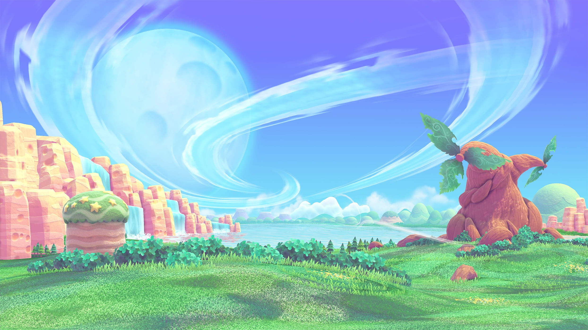

# Nintendo Switch Webpage

## 소개
##### 닌텐도 png 이미지를 이용해서 실물 닌텐도 화면 안에 게임 이미지가 나오는 웹페이지만들기

##### 해당 이미지 디스플레이 부분에 이미지가 나오도록 함 
##### 여러 게임 제목을 버튼으로 만들어 놓고 버튼을 누르면 해당 게임이 닌텐도 스위치 안에 표시되게 하기

##### 별의커비 게임의 경우 캐릭터들이 순차적으로 표시되는 것 까지 구현하도록 한다.


##### 스위치 이미지 하단에는 autoplay 되는 캐러셀을 넣는다.

### 소요시간
+ 23.08.11 ~ 

### 개발환경
+ Vanila Javascript

### 메모

#### **23.08.12**
##### 닌텐도 이미지를 띄우고 그 안에 게임 배경화면을 넣는 건 됐지만 반응형이 잘 안됨 <br>찾아보니 "vw" 단위로 설정하면 되는 것 같음 <br>시간이 없어서 일단 저장후 내일 하기로 함

#### **23.08.14**
##### 검색결과 vw 단위로 스위치 이미지 안에 다른 이미지들이 브라우저 창을 줄여도 상하좌우 위치에 맞게 줄어들게 만드려면<br>이미지박스에 바로 `position: relative`를 주는게 아니라 <br>모든 이미지들이 들어갈 container를 하나 만들고 거기에 `position: relative`를 줘야한다.<br>컨테이너 만드는 습관을 잘 들여야 하는듯..

#### HTML 파일
```html
<div class="switch-frame">
    <div class="switch">
        
    </div>
    <div class="kb">
        <div class="kb-bg">
            
        </div>
        <div class="kb-lor">
            
        </div>
        <div class="kb-mahoroa">
            
        </div>
    </div>
</div>
```
#### CSS 파일
```css
.switch-frame {
    position: relative;
    width: 100%;
}
.switch-frame {     
    position: relative; /* 스위치 이미지가 가장 상단에 위치*/
    width: 100%;
}
.switch img{    /* 스위치 이미지 100vw로 */
    width: 100vw;
}
/* 닌텐도 스위치 이미지를 가장 상단에 띄우기 위해 다른 이미지박스들의 z-index를 1로 줌 */
.kb div{            
    z-index: 1;
    position: absolute;
}

```


#### **23.08.15**

##### 먼저 이미지들을 화면에 배치한 후 (이미지파일을 못구해서 실제 웹페이지랑 똑같이는 못만들었다)


##### 자바스크립트로 순차적으로 이미지를 로딩하도록 한다.

```javascript
var kbImgs = document.querySelectorAll(".kb div");  //커비 이미지박스 노드리스트
var i = 1;
//순차적으로 별의 커비 이미지가 보이도록 함
//노드 리스트는 엄밀히 배열이 아니므로 forEach.call 메서드를 사용하면 Array의 메서드를 빌려사용할 수 있다.
Array.prototype.forEach.call(kbImgs, function(kbImg){
    setTimeout(function(){ kbImg.classList.add("visible")} , 300*i);
    if(i >= 7 ){        //7번째 사진 (별의커비 로고)부터 다른 사진이 뜨는 속도의 2배 느리게 보이도록 함
        i += 2;
    } else {
        i++;
    }
})
```

### 자바스크립트 코드 적용 후


#### 예쁘게 잘 뜬다!

### 새로 배운 사실: `Array.prototype.forEach.call` 에서 `.call` 메서드로 노드리스트에 forEach 구문을 사용할 수 있다.

